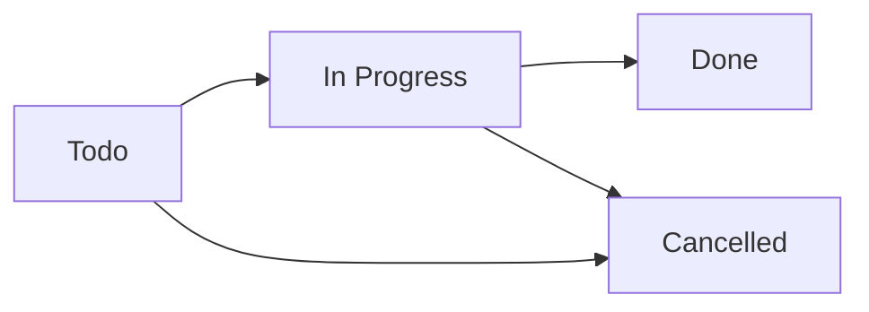

## Overview

Relio's task management system helps you organize work, track progress, and ensure nothing falls through the cracks. Create tasks linked to contacts, properties, companies, and deals, assign them to team members, and monitor completion.

<Info>
  Tasks integrate with all record types and support multiple assignees, due dates, and custom workflows.
</Info>

## Task Structure

### Core Fields

Every task includes:

- **Title** - Brief description of the work
- **Description** - Detailed notes and context
- **Status** - Current state (todo, in_progress, done, cancelled)
- **Priority** - Urgency level (low, medium, high, urgent)
- **Due Date** - Target completion date
- **Assignees** - Team members responsible
- **Linked Records** - Related contacts, properties, companies, deals

### Task Status Flow



**Status Options:**
- `todo` - Not started, awaiting action
- `in_progress` - Currently being worked on
- `done` - Completed successfully
- `cancelled` - No longer needed

### Priority Levels

<ResponseField name="Priority" type="enum">
  - **Urgent** - Immediate attention required
  - **High** - Important, needs prompt action
  - **Medium** - Standard priority
  - **Low** - Can be deferred if needed
</ResponseField>

## Creating Tasks

<Steps>
  <Step title="Set Title & Description">
    Provide a clear, actionable title and any necessary context
  </Step>
  
  <Step title="Link Records">
    Associate the task with relevant contacts, properties, companies, or deals
  </Step>
  
  <Step title="Assign Team Members">
    Select one or more assignees who will work on the task
  </Step>
  
  <Step title="Set Due Date & Priority">
    Choose when the task should be completed and its urgency level
  </Step>
</Steps>

### API Example

```typescript
const task = await trpc.tasks.create.mutate({
  title: "Follow up with prospect",
  description: "Discuss pricing options and answer questions about features",
  status: "todo",
  priority: "high",
  dueDate: "2024-03-20",
  assigneeIds: ["user_1", "user_2"],
  linkedRecords: [
    { recordType: "contact", recordId: "contact_id" },
    { recordType: "deal", recordId: "deal_id" }
  ]
});
```

### Quick Task Creation

Create tasks from various contexts:

**From Record Pages:**
```typescript
// On a contact detail page
const task = await trpc.tasks.create.mutate({
  title: "Send follow-up email",
  contactId: currentContact.id,
  assigneeIds: [currentUser.id],
  dueDate: new Date(Date.now() + 7 * 24 * 60 * 60 * 1000) // 1 week
});
```

**From Calendar:**
```typescript
// Click a date to create task
const task = await trpc.tasks.create.mutate({
  title: "Site visit",
  propertyId: selectedProperty.id,
  dueDate: clickedDate,
  status: "todo"
});
```

## Linked Records

### Multiple Record Links

Tasks can link to multiple records across different types:

```typescript
await trpc.tasks.create.mutate({
  title: "Prepare proposal",
  linkedRecords: [
    { recordType: "contact", recordId: "contact_1" },
    { recordType: "contact", recordId: "contact_2" },
    { recordType: "property", recordId: "property_1" },
    { recordType: "company", recordId: "company_1" },
    { recordType: "deal", recordId: "deal_1" }
  ]
});
```

<Note>
  The first linked record of each type is stored as `contactId`, `propertyId`, `companyId`, or `dealId` for backward compatibility. Additional links are stored in the `task_linked_records` table.
</Note>

### Legacy Single Links

For simpler tasks with single record association:

```typescript
await trpc.tasks.create.mutate({
  title: "Call prospect",
  contactId: "contact_id",
  propertyId: "property_id"
});
```

## Managing Tasks

### Updating Tasks

```typescript
await trpc.tasks.update.mutate({
  id: "task_id",
  status: "in_progress",
  priority: "urgent",
  dueDate: "2024-03-15",
  description: "Updated context and notes",
  assigneeIds: ["user_1", "user_2", "user_3"],
  linkedRecords: [
    // Update linked records
  ]
});
```

**Status Tracking:**
When status changes, `statusEnteredAt` is automatically updated to track time in each status.

### Reassigning Tasks

```typescript
// Replace all assignees
await trpc.tasks.update.mutate({
  id: "task_id",
  assigneeIds: ["new_user_id"]
});

// Add assignees (fetch current first)
const task = await trpc.tasks.getById.query("task_id");
const currentAssignees = task.assignees.map(a => a.userId);

await trpc.tasks.update.mutate({
  id: "task_id",
  assigneeIds: [...currentAssignees, "additional_user_id"]
});
```

### Completing Tasks

```typescript
await trpc.tasks.update.mutate({
  id: "task_id",
  status: "done"
});
```

<Tip>
  Configure column preferences to show confetti when tasks are marked complete for a celebratory touch!
</Tip>

## Viewing Tasks

### List View

Query tasks with advanced filtering:

```typescript
const { items, nextCursor } = await trpc.tasks.list.query({
  limit: 50,
  cursor: null,
  search: "follow up",
  status: "todo",
  priority: "high",
  assigneeId: "user_id",
  contactId: "contact_id",
  propertyId: "property_id",
  dueBefore: "2024-03-31",
  dueAfter: "2024-03-01",
  sortField: "dueDate",
  sortDirection: "asc",
  viewMode: "mine" // or "all" for admins
});
```

**Filter Options:**
- `search` - Text search in task titles
- `status` - Filter by status (todo, in_progress, done, cancelled)
- `priority` - Filter by priority level
- `assigneeId` - Tasks assigned to specific user
- `contactId`, `propertyId`, `companyId`, `dealId` - Tasks linked to records
- `dueBefore` / `dueAfter` - Date range filters
- `viewMode` - "mine" (assigned to me) or "all" (workspace-wide)

**Sorting:**
- `title` - Alphabetical
- `status` - By status
- `priority` - By priority level
- `dueDate` - By due date
- `createdAt` - By creation date
- `position` - Custom ordering

### Board View (Kanban)

Visualize tasks grouped by status:

```typescript
const columns = await trpc.tasks.board.query();

columns.forEach(column => {
  console.log(`${column.status}: ${column.count} tasks`);
  column.tasks.forEach(task => {
    console.log(`  - ${task.title}`);
  });
});
```

**Board Organization:**
- Columns for each status (Todo, In Progress, Done, Cancelled)
- Drag-and-drop between columns (UI)
- Task cards show title, assignees, due date, priority
- Linked record chips

### My Tasks

Non-admin users automatically see only their tasks:

```typescript
// For members, enforces viewMode: "mine"
const myTasks = await trpc.tasks.list.query({
  // Automatically filtered to:
  // - Tasks I created
  // - Tasks assigned to me
});
```

## Task Details

### Fetching Full Details

```typescript
const task = await trpc.tasks.getById.query("task_id");

console.log(task.title);
console.log(task.description);
console.log(`Status: ${task.status}`);
console.log(`Priority: ${task.priority}`);
console.log(`Due: ${task.dueDate}`);

console.log("Assignees:");
task.assignees.forEach(assignee => {
  console.log(`  - ${assignee.name}`);
});

console.log("Linked Records:");
task.linkedRecords.forEach(record => {
  console.log(`  - ${record.recordType}: ${record.name}`);
});
```

**Included Data:**
- Complete task fields
- Creator information
- Assignee details (name, image)
- Linked record metadata (name, image)
- Legacy links (contactId, propertyId, etc.)

## Column Preferences

### Custom Status Columns

Customize task status columns with workspace preferences:

```typescript
await trpc.tasks.updateColumnPreference.mutate({
  column: "in_progress",
  name: "Working On It",
  color: "#f59e0b",
  trackTimeInStatus: true,
  showConfetti: false,
  hidden: false,
  isComplete: false,
  targetTimeInStatus: 7,
  targetTimeUnit: "days"
});
```

**Preference Options:**
- `name` - Display name for the column
- `color` - Color for visual coding
- `trackTimeInStatus` - Monitor how long tasks stay in this status
- `showConfetti` - Celebrate when tasks reach this status
- `hidden` - Hide column from board view
- `isComplete` - Mark as a completion status
- `targetTimeInStatus` - Expected duration in this status
- `targetTimeUnit` - Time unit (days, weeks, months, years)

### Getting Column Preferences

```typescript
const preferences = await trpc.tasks.getColumnPreferences.query();

Object.entries(preferences).forEach(([column, pref]) => {
  console.log(`${column}: ${pref.name}`);
  if (pref.trackTimeInStatus) {
    console.log(`  Target: ${pref.targetTimeInStatus} ${pref.targetTimeUnit}`);
  }
});
```

## Permissions

### Access Control

**Admin & Owner:**
- View all workspace tasks
- Edit and delete any task
- Assign tasks to anyone

**Members:**
- View tasks they created
- View tasks assigned to them
- Edit only their own tasks
- Delete only their own tasks

### Creating Tasks

```typescript
// All users can create tasks
const task = await trpc.tasks.create.mutate({
  title: "New task",
  assigneeIds: ["user_id"], // Can assign to others
  // createdById set automatically
});
```

### Editing Restrictions

```typescript
// Members can only update tasks they created or are assigned to
try {
  await trpc.tasks.update.mutate({
    id: "other_user_task",
    status: "done"
  });
} catch (error) {
  // TRPCError: FORBIDDEN
  // "You can only update tasks assigned to you or created by you."
}
```

## Advanced Features

### Time Tracking

Track how long tasks spend in each status:

```typescript
const task = await trpc.tasks.getById.query("task_id");
const timeInStatus = Date.now() - new Date(task.statusEnteredAt).getTime();
const daysInStatus = timeInStatus / (1000 * 60 * 60 * 24);

console.log(`Task has been ${task.status} for ${daysInStatus.toFixed(1)} days`);
```

### Custom Positioning

Control task order within columns:

```typescript
// Set custom position
await trpc.tasks.create.mutate({
  title: "High priority task",
  position: 0 // Appears first
});

await trpc.tasks.update.mutate({
  id: "task_id",
  position: 5 // Move to 6th position
});
```

### Bulk Operations

Perform operations on multiple tasks:

```typescript
// Get all overdue tasks
const yesterday = new Date(Date.now() - 24 * 60 * 60 * 1000);
const { items: overdueTasks } = await trpc.tasks.list.query({
  status: "todo",
  dueBefore: yesterday.toISOString(),
  limit: 1000
});

// Update priority for all
for (const task of overdueTasks) {
  await trpc.tasks.update.mutate({
    id: task.id,
    priority: "urgent"
  });
}
```

## Integration Examples

### With Calendar

```typescript
// Display tasks on a calendar
const tasks = await trpc.tasks.list.query({
  dueAfter: monthStart.toISOString(),
  dueBefore: monthEnd.toISOString(),
  sortField: "dueDate",
  sortDirection: "asc"
});

// Group by date
const tasksByDate = tasks.items.reduce((acc, task) => {
  const date = task.dueDate?.toISOString().split('T')[0];
  if (date) {
    acc[date] = acc[date] || [];
    acc[date].push(task);
  }
  return acc;
}, {});
```

### With Notifications

```typescript
// Send reminders for upcoming tasks
const tomorrow = new Date(Date.now() + 24 * 60 * 60 * 1000);
const { items: upcomingTasks } = await trpc.tasks.list.query({
  status: "todo",
  dueAfter: new Date().toISOString(),
  dueBefore: tomorrow.toISOString()
});

for (const task of upcomingTasks) {
  // Send notification to assignees
  for (const assignee of task.assignees) {
    await sendNotification(assignee.userId, {
      title: "Task Due Tomorrow",
      body: task.title
    });
  }
}
```

### With Properties

```typescript
// Get all tasks for a property
const propertyTasks = await trpc.tasks.list.query({
  propertyId: "property_id",
  sortField: "dueDate",
  sortDirection: "asc"
});

// Display on property detail page
console.log(`${propertyTasks.items.length} tasks for this property`);
```

## Best Practices

<AccordionGroup>
  <Accordion title="Task Organization">
    - Keep task titles short and action-oriented
    - Use descriptions for detailed context and notes
    - Set realistic due dates
    - Assign multiple people only when necessary
    - Link relevant records for easy navigation
  </Accordion>
  
  <Accordion title="Status Management">
    - Move tasks to "in_progress" when starting work
    - Update status regularly to reflect reality
    - Use "cancelled" for tasks no longer needed
    - Configure column preferences for your workflow
    - Track time in status to identify bottlenecks
  </Accordion>
  
  <Accordion title="Priority Handling">
    - Reserve "urgent" for truly time-sensitive items
    - Use "high" for important but not immediate work
    - Review and adjust priorities as situations change
    - Consider priority when sorting task lists
  </Accordion>
</AccordionGroup>

## Keyboard Shortcuts

<ResponseField name="Shortcuts" type="Task Management">
  - **n** - New task
  - **Space** - Toggle task status
  - **e** - Edit task
  - **Delete** - Delete task
  - **Escape** - Close task detail
</ResponseField>

## Related Features

<CardGroup cols={2}>
  <Card title="Contacts" icon="users" href="/features/contacts">
    Link tasks to contacts for relationship management
  </Card>
  
  <Card title="Properties" icon="building" href="/features/properties">
    Track property-related tasks and follow-ups
  </Card>
  
  <Card title="Deals" icon="handshake" href="/features/deals">
    Manage deal progression with linked tasks
  </Card>
  
  <Card title="Activities" icon="timeline" href="/features/activities">
    Track activities and task completion
  </Card>
</CardGroup>